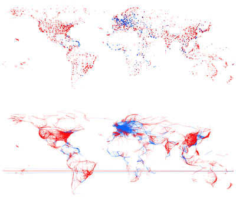
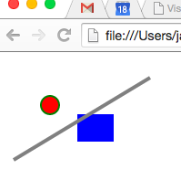
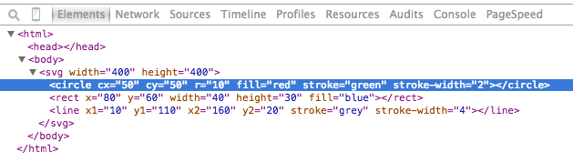
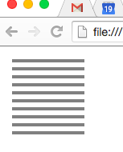

# Hands-on exercise data visualization {.unnumbered}
Author - Jan Aerts, Visual Data Analysis Lab, KU Leuven - http://vda-lab.be

In this exercise, we will use D3 ([http://d3js.org](http://d3js.org)) to generate visualizations based on a flights dataset. This tutorial holds numerous code snippets that can be copy/pasted and modified for your own purpose.



D3 stands for Data-Driven Documents. It is a toolkit for visualizing data using web-standards: HTML, CSS, SVG and javascript. In this tutorial, though, we will take a very practical approach and work our way from very simple to more complex visualizations.

# HTML and SVG
A minimal file showing visual *marks* is provided below.

*Script 1*
```html
[1]  <html>
[2]  <body>
[3]    <svg width=400 height=400>
[4]      <circle cx="100" cy="100" r="10" fill="blue" />
[5]      <circle cx="120" cy="90" r="20" fill="red" />
[6]    </svg>
[7]  </body>
[8]  </html>
```
If we save this file with an ``.html`` extension (e.g. "script1.html") and open it in a webbrowser, we see the following image:



The numbers at the front of each line are the *line numbers* and are actually not part of the program. We've added them here to be able to refer to specific lines. So if you type in this piece of code, *do not type the line numbers*. Lines 4 and 6 are too long to fit in the window, so we wrapped those lines here. This is perfectly valid and putting the properties of a single element on different lines can sometimes be useful to keep a good overview.

So what have we done? We basically created a webpage, containing HTML and SVG. Both are markup languages that describe information using XML. In XML, things are described using **tags**. As in the example above, an HTML file should start with the opening tag ``<html>`` and end with the closing tag ``</html>``. These tags define the *html* **element**. Each opening tag should have a closing tag: the *body* of the file starts at ``<body>`` and ends at ``</body>``; the *svg* of the file starts at ``<svg>`` and ends at ``</svg>``. These tags define a **hierarchy** in the file: the ``html`` is the **parent** of ``body`` (in other words: ``body`` is a **child** of ``html``); ``body`` is the parent of ``svg``, and ``svg`` is the parent of ``circle``, ``rect`` and ``line``. ``circle``, ``rect`` and ``line`` are **siblings** of each other. If you paid attention you noticed that there are no closing tags ``</circle>``, ``</rect>`` and ``</line>``. In case an element does not have any children, we can omit the closing tag if we add a forward slash in front of the closing bracket, like so: ``<rect />``. This is the same as if we would write ``<rect></rect>``.

So if we disect the hierarchy in the script above, we basically have an HTML part (defining the *basic structure of the webpage*)
```html
[1]  <html>
[2]  <body>
[8]  </body>
[9]  </html>
```
where the ``body`` contains an SVG element (defining the *actual visual elements*)
```html
[3]    <svg>
[4]      <circle />
[5]      <rect />
[6]      <line />
[7]    </svg>
```
SVG stands for Scalable Vector Graphics and is described in XML just like HTML is. 

In the first bit of code, the SVG elements have **properties**. These are added in the opening tags of the elements, are in the form of ``tag=value`` and separated with spaces. The ``svg`` element, for example, has a ``width`` and ``height`` of 400 pixels; the ``circle`` has a ``cx`` (*x*-position of the *c*enter) of 50, a ``cy`` of 50, an ``r`` (*r*adius) of 5 pixels, a ``fill`` (colour) of `red`, a ``stroke`` (the line around the object) of ``green`` and a ``stroke-width`` (width of that line) of 2 pixels. So there properties define what the elements should look like.

Several mark primitives exist (ellipse, circle, rect, line, ...). You can find a list of these with the properties that they have at [https://developer.mozilla.org/en-US/docs/Web/SVG/Element#Basic_shapes](http://developer.mozilla.org/en-US/docs/Web/SVG/Element#Basic_shapes).

# Inspecting the code

We can actually play live a bit with these properties. Chrome and Firefox have "developer tools" that let you change these properties at run time. In Chrome, go to *View*, then *Developer* and *Developer Tools*. If you then click on the *Elements* tab in the new sub-window, you will see the actual code behind the webpage. Double-clicking on a property value allows you to change it. Go ahead: change the colour of the circle from red to yellow.



# Using javascript

What if we want to do something multiple times? Suppose we want to draw 10 lines underneath each other. We could do that like this:

*Script 2*
```html
[1]  <html>
[2]  <body>
[3]    <svg width=400 height=400>
[4]      <line x1=10 y1=10 x2=100 y2=10 stroke="grey" />
[5]      <line x1=10 y1=20 x2=100 y2=20 stroke="grey" />
[6]      <line x1=10 y1=30 x2=100 y2=30 stroke="grey" />
[7]      <line x1=10 y1=40 x2=100 y2=40 stroke="grey" />
[8]      <line x1=10 y1=50 x2=100 y2=50 stroke="grey" />
[9]      <line x1=10 y1=60 x2=100 y2=60 stroke="grey" />
[10]     <line x1=10 y1=70 x2=100 y2=70 stroke="grey" />
[11]     <line x1=10 y1=80 x2=100 y2=80 stroke="grey" />
[12]     <line x1=10 y1=90 x2=100 y2=90 stroke="grey" />
[13]     <line x1=10 y1=100 x2=100 y2=100 stroke="grey" />
[14]   </svg>
[15] </body>
[16] </html>
```
This generates this image:



Of course this is not ideal: what if we have 5,000 lines to plot? To handle real data, we will need variables, loops, and conditionals.

In the code block above, the definition of every line is the same, except for the values of ``y1`` and ``y2``. How can we get rid of this repetition? By using *scripting*, in particular: javascript. But let's do this in steps.

What would a HTML file look like if we would use javascript?

*Script 3*
```html
[1]  <!DOCTYPE html>
[2]  <html lang="en">
[3]  <head>
[4]  	<script type="text/javascript"
               src="http://mbostock.github.com/d3/d3.js"></script>
[5]  </head>
[6]  <body>
[7]  <svg width=400 height=400></svg>
[8]  <script type="text/javascript">

[9]    var svg = d3.select("svg")
[10]   svg.append("circle")
          .attr({cx: 100, cy: 100, r: 10})
          .style({fill: "blue"})
[11]   svg.append("circle")
          .attr({cx: 120, cy: 90, r: 20})
          .style({fill: "red"})

[12] </script>
[13] </body>
[14] </html>
```

How is this different from *Script 2*? Apart from the fact that we added a ``head`` section, we replaced the complete ``svg``-part with a single, *empty* SVG element (line [7]). Just below it, we then added a bit of javascript (lines [8] to [12]) which takes that empty SVG element, and adds (`append`) two circles to it. These circles need some attributes before we can draw them: they need the x-position of the center (`cx`), the y-position of the center (`cy`), and a radius `r`. In addition, we can change the appearance of the circles using `style`. Both `attr` and `style` take an object ("hash") as their parameter: a set of key-value pairs surrounded by curly braces `{}`.

# Actually using data

## Accessing data defined in the script itself

This is nice, but of course we want to display real data. Suppose we have an array of numbers and we want to draw circles using the value of each number as the x-position. Here's a standard way of displaying actual data:

*Script 4*
```html
[1]  <!DOCTYPE html>
[2]  <html lang="en">
[3]  <head>
[4]  <script type="text/javascript"
[5]          src="http://mbostock.github.com/d3/d3.js"></script>
[6]  </head>
[7]  <body>
[8]  <svg></svg>
[9]  <script type="text/javascript">
[10]   var svg = d3.select("svg")
[11]   var data = [30,382,59,102,200];
[12]   svg.selectAll("circle")
[13]      .data(data)
[14]      .enter()
[15]      .append("circle")
[16]      .attr({
[17]        cx: function(d,i) { return d },
[18]        cy: 100,
[19]        r: 10
[20]      })
[21]      .style({
[22]        fill: "blue"
[23]      })
[24] </script>
[25] </body>
[26] </html>
```

So what's different here?

First of all, we define a variable `data` that has some actual data in that we want to plot (line 11). 

## Accessing data from an external file

### Running a HTTP server


# Interaction

# Advanced topics

## Bootstrap

# Good books
