% Hands-on exercise data visualization
% Jan Aerts, Visual Data Analysis Lab, KU Leuven - http://vda-lab.be

In this exercise, we will use the Processing tool ([http://processing.org](http://processing.org)) to generate visualizations based on a flights dataset. This tutorial holds numerous code snippets that can by copy/pasted and modified for your own purpose. The contents of this tutorial is available under the CC-BY license.


# Introduction to Processing
Processing is a language based on java, with its own development environment. Although it is basically java, much of the boilerplate code is not necessary. It therefore becomes a language accessible to people with little or no programming background.

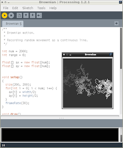

## Download and install Processing
Processing can be downloaded from [http://processing.org/download/](http://processing.org/download/).

* For Windows: Double-click the zip-file; there should be a `processing.exe` file which is your program.
* For Mac: Just double-click the downloaded file.
* For linux: Download the `.tgz` file, and run `tar -xvzf that_file.tgz`.

## A minimal script
A minimal script is provided below.

*Script 1*
``` {.java .numberLines}
size(400,400);

fill(255,0,0);
ellipse(100,150,20,20);

fill(0,255,0);
rect(200,200,50,60);

stroke(0,0,255);
strokeWeight(5);
line(150,5,150,50);
```
This code generates the following image:

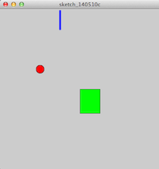

The numbers at the front of each line are the *line numbers* and are actually not part of the program. We've added them here to be able to refer to specific lines. So if you type in this piece of code, *do not type the line numbers*.

Let's walk through each line. The script is made up of a list of **statements**. The first line in the script `size(400,400);` sets the **dimensions of the resulting image**. In this case, we'll generate a picture of 400x400 pixels.
Next, (line `[3]`) we set the **colour** of anything we draw to red. The `fill` function takes 3 parameters, which are the values for red, green, and blue (RGB), ranging from 0 to 255. We then draw an **ellipse** with its center at horizontal position 100 pixels and vertical position 150 pixels. Note that the vertical position counts from the top down instead of from the bottom up. The **point `(0,0)` is at the top left** rather than the bottom left... For the ellipse we set both the horizontal and vertical diameter to 20 pixels, which results in a circle.
The next thing we do (line `[6]`) is set the colour of anything that we will draw to green `fill(0,255,0);`, and draw a **rectangle** at position `(200,200)` with width set to 50 and height to 60.

Finally, we set the colour of lines to blue (`stroke(0,0,255);`), the stroke weight to 5 pixels `strokeWeight(5);`, and draw a **line** `line(150,5,150,50);`. This line runs from point `(150,5)` to `(150,50)`.

Both `fill` and `stroke` are used to set colour: `fill` to set the colour of the shape, `stroke` to set the colour of the border around that shape. In case of *lines*, only the `stroke` colour can be set.

Several drawing primitives exist, including `line`, `rect`, `triangle`, and `ellipse` (a circle is an ellipse with the same horizontal and vertical radius). A treasure trove of information for these is available in the [Processing reference pages](http://processing.org/reference/).

Apart from these primitives, Processing contains functions that modify properties of these primitives. These include setting the fill color (`fill`), color of lines (`stroke`), and line weight (`lineWeight`). Again, the reference pages host all information.

## Variables, loops and conditionals
What if we want to do something multiple times? Suppose we want to draw 10 lines underneath each other. We could do that like this:

*Script 2*
``` {.java .numberLines}
size(500,150);
background(255,255,255);
line(100,0,400,0);
line(100,10,400,10);
line(100,20,400,20);
line(100,30,400,30);
line(100,40,400,40);
line(100,50,400,50);
line(100,60,400,60);
line(100,70,400,70);
line(100,80,400,80);
line(100,90,400,90);
```
This generates this image:

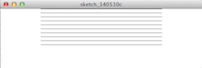

Of course this is not ideal: what if we have 5,000 datapoints to plot? To handle real data, we will need variables, loops, and conditionals.

In the code block above, we can replace the hard-coded numbers with **variables**. These can be integers, floats, strings, arrays, etc. To declare an integer variable, we have to prefix it with `int`. The statement `int startX = 100;` below therefore means "create an integer called startX, and give it the value of 100".

*Script 3*
``` {.java .numberLines}
size(500,150);
int startX = 100;
int stopX = 400;
background(255,255,255);
for ( int i = 0; i < 10; i++ ) {
  line(100,i*10,400,i*10);
}
```
A loop looks like this:
```java
for ( int i = 0; i < 10; i++ ) {
	// do something
}
```

We first set the variables `startX` and `stopX` to `100` and `400`. We then **loop** over values `i`, which starts at `0` and increases in each loop as long as it is smaller than `10`. In each loop, a `line` is drawn. 

We can use **conditionals** to for example distinguish odd or even lines by colour.
*Script 4*
``` {.java .numberLines}
size(500,150);
int startX = 100;
int stopX = 400;
background(255,255,255);
strokeWeight(2);
for ( int i = 0; i < 10; i++ ) {
  if ( i%2 == 0 ) {
    stroke(255,0,0);
  } else {
    stroke(0,0,255);
  }
  line(startX,i*10,stopX,i*10);
}
```
In this code snippet, we check in each loop if `i` is even or odd, and let the stroke colour depend on that result. An `if`-clause has the following form:
```java
if ( *condition* ) {
	// do something
} else {
	// do something else
}
```
The condition `i%2 == 0` means: does dividing the number `i` with 2 result in a remainder of zero? Note that we have to use 2 equal-signs here (`==`) instead of just one (`=`). This is so to distinguish between a test for equality, and an assignment. Don't make errors against this...

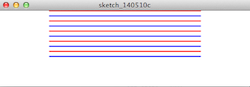

## Exercise data
The data for this exercise concerns **flight information** between different cities. Each entry in the dataset contains the following fields:

* from_airport
* from_city
* from_country
* from_long
* from_lat
* to_airport
* to_city
* to_country
* to_long
* to_lat
* airline
* airline_country
* distance

### Getting the data
First **save your sketch**. In the directory where you saved it, create a new folder called `data`. Download the file [**http://bitbucket.org/jandot/flamesworkshop/downloads/flights.csv**](http://bitbucket.org/jandot/flamesworkshop/downloads/flights.csv) into this new folder.

### Accessing the data from Processing
Let's write a small script in Processing to visualize this data. The **visual encoding** that we'll use for each flight will be the following:

* x position is defined by longitude of departure airport
* y position is defined by latitude of departure airport

*Script 5*
``` {.java .numberLines}
Table table = loadTable("flights.csv","header");

size(800,800);
noStroke();
fill(0,0,255,10); // colour = blue; transparency = 10%

background(255,255,255); // set background to white
for ( TableRow row : table.rows() ) {
  float from_long = row.getFloat("from_long");
  float from_lat = row.getFloat("from_lat");
  float x = map(from_long,-180,180,0,width);
  float y = map(from_lat,-180,180,height,0);
  ellipse(x,y,3,3);
}
```

The resulting image:

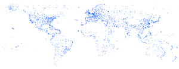

You can see that the resulting image shows a map of the world, with areas with high airport density clearly visible. Notice that the data itself does not contain any information where the continents, oceans and coasts are; still, these are clearly visible in the image.

Let's go through the code:

* [1] The data from the file "flights.csv" is read into a variable `table` which is of type `Table`. The `"header"` indicates that the first line of the file is a list of column headers.
* [4] `noStroke()` tell Processing to not draw the border around disks, rectangles or other elements.
* [8] This is another way to loop over a collection, instead of the `for ( int i = 0; i < 10; i++ ) { }` we used before. In this line, we loop over all `table.rows()`, and each time we put the new row into a variable `row`.
* [9] `row.getFloat("from_long")` extracts the value from the `from_long` column from that row and makes it a `float`. This is then stored in the variable `from_long`.
* [11] In this line, we transform the longitude value to a value between 0 and the width of our canvas.

The `map` function is very useful. It is used to **rescale** values. In our case, longitude values range from `-180` to `180`. The `x` position of the dots on the screen, however, have to be between 0 and 800 (because that's the width of our canvas, as set in `canvase(800,800);`). In this case, we can even use the variable `width` instead of `800`, because `width` and `height` are set automatically when we call the statement `size(800,800);`.
You see that the `map` function for `y` recalculates the `from_lat` value to something between `height` and `0`, instead of between `0` and `height`. The reason is that the *origin* of our canvas is at the top-left corner instead of the bottom-left one so we have to flip coordinates.

We can add additional information to this visualization. In the next code block, we alter our script so that colour of the dots is red for domestic flights and blue for international flights. In addition, the size of the dots is proportional to the distance of that particular flight.

*Script 6*
``` {.java .numberLines}
Table table = loadTable("flights.csv","header");

size(800,800);
noStroke();

background(255,255,255); // set background to white
for ( TableRow row : table.rows() ) {
  float from_long = row.getFloat("from_long");
  float from_lat = row.getFloat("from_lat");
  String from_country = row.getString("from_country");
  String to_country = row.getString("to_country");
  int distance = row.getInt("distance");
  
  float x = map(from_long,-180,180,0,width);
  float y = map(from_lat,-180,180,height,0);
  if ( from_country.equals(to_country) ) {
    fill(255,0,0,10);
  } else {
    fill(0,0,255,10);
  }
  float r = map(distance, 1, 15406, 3, 15);
  
  ellipse(x,y,r,r);
}
```

In line [21], we rescale the value of the distance (min = 1, max = 15406) to a minimum of 3 and maximum of 15. That value is than used as the radius `r`.

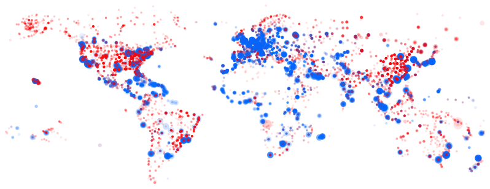

From this picture, we can deduce many things:

* Airports tend to be located on land => plotting latitude and longitude recreates a worldmap.
* Blue international flights tend to depart from coastal regions.
* There are few domestic flights within Europe.
* Longer flights (departure airports with larger radius) tend to leave in coastal regions

## Interactivity and defining functions
It is often the interactivity in data visualization that helps gaining insights in that data and finding new hypotheses. Up until now, we have generated static images. How can we add interactivity?

As a first use case, say that we want the radius of the dots to depend on the position of the mouse instead of the distance of the flight: if our mouse is at the left of the image, all dots should be small; if it is at the right, they should be large. We will change the line `float r = map(distance,1,15406,3,15);` to include information on the mouse position.

This time, instead of creating a simple image, this image will have to be **redrawn** constantly taking into account the mouse position. For this, we have to rearrange our code a little bit. Some of the code has to run only once to initialize the visualization, while the rest of the code has to be rerun constantly. We do this by putting the code that we have either in the `setup()` or the `draw()` function:
``` {.java .numberLines}
// define global variables here
void setup() {
  // code that has to be run only once
}
void draw() {
  // code that has to be rerun constantly
}
```

A **function definition** (such as `setup` and `draw`) in Java always has the same elements:

1. The **type of return value**
1. The **name** of the function
1. The types and names of **parameters**, between parentheses
1. The **actual code** of the function, between curly braces

Both the `setup()` and the `draw()` functions don't take any parameters, so we just use empty parentheses. Also, they do not return a specific value (an integer, a float, a boolean, ...), so we use the return type `void`.

The `setup()` function is only run once; the `draw()` function is run by default 60 times per second.

Let's put all statements we had before into one of these two functions:

*Script 7*
``` {.java .numberLines}
Table table;

void setup() {
  size(800,800);
  table = loadTable("flights.csv","header");
  noStroke();
}

void draw() {
  background(255,255,255); // set background to white
  for ( TableRow row : table.rows() ) {
    float from_long = row.getFloat("from_long");
    float from_lat = row.getFloat("from_lat");
    String from_country = row.getString("from_country");
    String to_country = row.getString("to_country");
    int distance = row.getInt("distance");
    
    float x = map(from_long,-180,180,10,width-10);
    float y = map(from_lat,-180,180,height-10,10);
    if ( from_country.equals(to_country) ) {
      fill(255,0,0,10);
    } else {
      fill(0,0,255,10);
    }
    float r = map(distance, 0, 15406, 3, 15);
    
    ellipse(x,y,r,r);
  }
}
```

The `draw()` function is run 60 times per second. This means that 60 times per second each line in the input table is processed again to draw a new circle. As this is quite compute intensive, your computer might actually not be able to redraw 60 times per second, and show some lagging. For simplicity's sake, we will however not go into optimization here.

Some things to note:

* We have to define the `table` variable at the top, and load the actual data (using `loadTable`) in the `setup()` function.
* We have to set the background every single redraw. If we wouldn't, each picture is drawn on top of the previous one.

Now how do we adapt this so that the radius of the circles depends on the x-position of my pointer? Luckily, Processing provides two variables called `mouseX` and `mouseY` that are very useful. `mouseX` returns the x position of the pointer. So basically the only thing we have to do is replace `float r = map(distance, 0, 15406, 3, 15);` with `float r = map(mouseX, 0, 800, 3, 15);` (Note that we changed the `15406` to `800`.) If we do that, and our mouse is towards the right side of the image, we get the following picture:

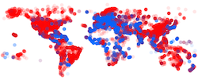

**Some optimization**
Let's optimize this code a tiny bit. We could for example remove the lines that handle the `distance` because we don't use them. However, we'll leave those in because we'll use them in the next example...
Something else that we can do is **limit the number of times the picture is redrawn**. As long as I don't move my mouse I don't have to redraw the picture. To do that, we add `noLoop();` to the `setup()` function, and add a new function at the bottom, called `mouseMoved()`. In this new function, we tell Processing to `redraw()` the canvas. The resulting code looks like this:

*Script 8*
``` {.java .numberLines}
Table table;

void setup() {
  size(800,800);
  table = loadTable("flights.csv","header");
  noLoop();
  noStroke();
}

void draw() {
  background(255,255,255); // set background to white
  for ( TableRow row : table.rows() ) {
    float from_long = row.getFloat("from_long");
    float from_lat = row.getFloat("from_lat");
    String from_country = row.getString("from_country");
    String to_country = row.getString("to_country");
    int distance = row.getInt("distance");
    
    float x = map(from_long,-180,180,10,width-10);
    float y = map(from_lat,-180,180,height-10,10);
    if ( from_country.equals(to_country) ) {
      fill(255,0,0,10);
    } else {
      fill(0,0,255,10);
    }
    float r = map(mouseX, 0, 800, 3, 15);
    
    ellipse(x,y,r,r);
  }
}

void mouseMoved() {
  redraw();  
}
```

### More useful interactivity

This interactivity can be made more useful: we can use the mouse pointer as a **filter**. For example: *if our mouse is at the left only short distance flights are drawn; if our mouse is at the right only long distance flights are drawn*.

*Script 9*
``` {.java .numberLines}
Table table;

void setup() {
  size(800,800);
  table = loadTable("flights.csv","header");
  noLoop();
  noStroke();
}

void draw() {
  background(255,255,255); // set background to white
  for ( TableRow row : table.rows() ) {
    int distance = row.getInt("distance");
    float mouseXMin = mouseX - 25;
    float mouseXMax = mouseX + 25;
    float minDistance = map(mouseXMin, 0, 800, 0, 15406);
    float maxDistance = map(mouseXMax, 0, 800, 0, 15406);

    if ( minDistance < distance && distance < maxDistance ) {
      float from_long = row.getFloat("from_long");
      float from_lat = row.getFloat("from_lat");
      String from_country = row.getString("from_country");
      String to_country = row.getString("to_country");
  
      float x = map(from_long,-180,180,10,width-10);
      float y = map(from_lat,-180,180,height-10,10);
      if ( from_country.equals(to_country) ) {
        fill(255,0,0,10);
      } else {
        fill(0,0,255,10);
      }
      ellipse(x,y,3,3);
    }
  }
}

void mouseMoved() {
  redraw();  
}
```
We will only draw flights if their duration is between a calculated `minDistance` and `maxDistance`. That's what we do on line [19]: the `&&` indicates `and`. Of course we first have to calculate `minDistance` and `maxDistance`. That's what we do on lines [14] to [17]. In lines [14] and [15], we say that we will be looking 25 pixels at either side of the mouse position. If the pointer is at position 175, `mouseMin` is set to 150 and `mouseMax` to 200. This pixelrange is then translated into distance range on lines [16] and [17].

Now it gets interesting. We can now look a bit deeper into the data... If we have our mouse at the left side of the image, it looks like this:

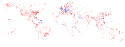

Having the mouse in the middle to the canvas gives us this image:

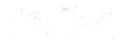

Playing with this visualization, there are some signals that pop up. Moving left and right at about 70-90 pixels from the left, we see a "snake" moving along the north-east coast of Brazil (see Figure below, also indicating position of mouse). This indicates that most of these flights probably go to the same major city in that country. Other dynamic patterns appear in Europe as well. In Figure 10, some dots appear to be darker than others. Why do you think this is?

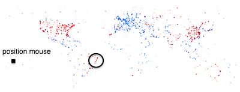

## Buttons and sliders

Of course many tools have buttons and sliders. Let's implement those in Processing. Instead of using the mouse position as a filter as before, why don't we make a slider to do the same? Unfortunately, this is a bit more complex than it should be... So let's first start with a **button**. To create a button, what we basically do is draw a rectangle, and check if the mouse position is within the area of that rectangle when we press the mouse button.

*Script 10*
``` {.java .numberLines}
Table table;
boolean grey;

void setup() {
  size(800,800);
  table = loadTable("flights.csv","header");
  grey = true;
  noLoop();
  noStroke();
}

void draw() {
  background(255,255,255); // set background to white
  fill(100,100,100);
  rect(50,100,20,20);
  for ( TableRow row : table.rows() ) {
    int distance = row.getInt("distance");
    float mouseXMin = mouseX - 25;
    float mouseXMax = mouseX + 25;
    float minDistance = map(mouseXMin, 0, 800, 0, 15406);
    float maxDistance = map(mouseXMax, 0, 800, 0, 15406);

    if ( minDistance < distance && distance < maxDistance ) {
      float from_long = row.getFloat("from_long");
      float from_lat = row.getFloat("from_lat");
      String from_country = row.getString("from_country");
      String to_country = row.getString("to_country");
  
      float x = map(from_long,-180,180,10,width-10);
      float y = map(from_lat,-180,180,height-10,10);
      
      if ( grey == true ) {
        fill(100,100,100,10);
      } else {
        if ( from_country.equals(to_country) ) {
          fill(255,0,0,10);
        } else {
          fill(0,0,255,10);
        }
      }
      ellipse(x,y,3,3);
    }
  }
}

void mouseClicked() {
  if ( mouseX > 50 && mouseX < 70 &&
       mouseY > 100 && mouseY < 120 ) {
    if ( grey == true ) {
      grey = false;
    } else {
      grey = true;
    }
    redraw();
  }
}

void mouseMoved() {
  redraw();  
}
```

Now, we basically keep track of a variable called `grey` which can be `true` or `false` (such variable is called a "boolean"). If it is `true` then all points will be drawn in grey; if it is `false` then the points will be blue or red just like before.

We define the boolean `grey` at the top (line [2]) and gave it a value of `true` in the setup (line [7]). Then, we draw a little square (line [15]) just so that we have something to point at. Next, we change the line [27-31] from script 9 into line [32-40] in script 10. This first checks if the boolean `grey` is set to true, and sets the fill colour based on that information. Finally, we create a new method called `mouseClicked` (line [46-56]) to handle the actual click event itself. This method (which really must be called "mouseClicked") will be run every time you click the mouse. If you do so, it will check if the position of the mouse is within the range of the rectangle that we drew in the beginning. If it is, it changes the value of `grey` and redraws the map. See the reference guide on the Processing.org website for more information on `mouseClicked()`.

*Note that there is basically no connection between the rectangle we draw at line [15] and the actual click event: we have to check if our mouse is over the rectangle ourselves; we're not able to say "if this rectangle is clicked". We could just as well remove line [15] (so that we don't see a rectangle) and the visualization would still work exactly the same. The only problem would be that you wouldn't know where the region that we define in lines [47-48] actually is...*

Now let's implement an actual **slider**. This looks a lot like what we had before in script 9, but we obviously have to change some things. Let's start with the final script, which was adapted from script 9:

*Script 11*
``` {.java .numberLines}
Table table;
float circlePosition;

void setup() {
  size(800,800);
  table = loadTable("flights.csv","header");
  noLoop();
  circlePosition = 50;
}

void draw() {
  background(255,255,255); // set background to white
  stroke(150,150,150);
  line(50,150,150,150); // draw the line of 100 pixels long
  noStroke();
  fill(150,150,150);
  ellipse(circlePosition,150,10,10);
  
  for ( TableRow row : table.rows() ) {
    int distance = row.getInt("distance");
    float circleXMin = circlePosition - 2;
    float circleXMax = circlePosition + 2;
    float minDistance = map(circleXMin, 50, 150, 0, 15406);
    float maxDistance = map(circleXMax, 50, 150, 0, 15406);

    if ( minDistance < distance && distance < maxDistance ) {
      float from_long = row.getFloat("from_long");
      float from_lat = row.getFloat("from_lat");
      String from_country = row.getString("from_country");
      String to_country = row.getString("to_country");

      float x = map(from_long,-180,180,10,width-10);
      float y = map(from_lat,-180,180,height-10,10);
      
      if ( from_country.equals(to_country) ) {
        fill(255,0,0,10);
      } else {
        fill(0,0,255,10);
      }
      ellipse(x,y,3,3);
    }
  }
}

void mouseDragged() {
  if ( abs(mouseX - circlePosition) <= 5 &&
       abs(mouseY - 150) <= 5 &&
       mouseX >= 50 && mouseX <= 150 ) {
    circlePosition = mouseX;
  }
  redraw();
}
```

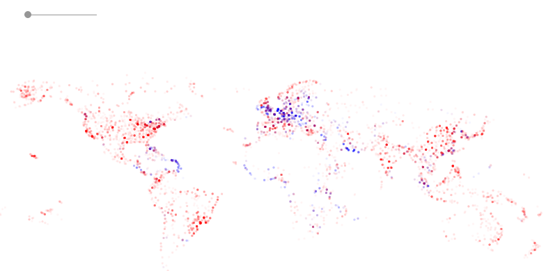

So what changed? We now define a variable (a float) called `circlePosition` at the top and set its initial value to 50 on line [8]. At the start of the `draw()` function [13-17], we also draw a line that will serve as a guide as well as the actual circle. Furthermore, we change lines [21-24] to refer to the `circlePosition` instead of `mouseX`. Note that that includes using +/- 2 instead of +/- 25 as a buffer, and using the minimum and maximum values of the line (i.e. 50 and 150) instead of those of the mouse in the map functions. Finally, we write the `mouseDragged()` function at the bottom (lines [45-52]). A "mouse-drag" in Processing-speak means: pressing the mouse button, then moving the mouse to another position, and finally releasing the mouse button. The `mouseDragged()` function looks a lot like the `mouseClicked()` function in script 10. We want to make sure that we are on top of the circle when we start dragging (both horizontally [46] and vertically [47]). Also, we need to make sure that we cannot drag the circle further than the minimum or maximum value [48]. If the situation complies to these three conditions, we change the `circlePosition` to `mouseX`, which basically means that the circle follows the mouse. Don't forget the `redraw()` or the scene will not be updated. Question: what happens if you drag the mouse too fast? Why is that? And just for laughs: remove the conditions on line [48] and see what happens if you start interacting with the visualization...

## Brushing and linking

Very often, you will want to create views that show different aspects of the same data. In our flights case, we might want to have both a map and a histogram of the flight distances. To be able to do this, we will have to look at how to create objects.

### Working with objects

#### Dogs

The code that we have been writing so far is what they call "imperative": the code does not know what we are talking about (i.e. flight data); it just performs a single action for each line in the file. As a result, all things (dots) on the screen are completely independent. They do not know of each other's existence. To create linked views, however, we will need to make these visuals more self-aware, which we do by working with **objects**. Objects are members of a specific **class**. For example, Rusty, Duke and Lucy are three dogs; in object-oriented speak, we say that Rusty, Duke and Lucy are "objects" of the "class" dog. Of course, all dogs have types of **properties** in common: they have names, have a breed, a weight, etc. At the same time, they share some **methods**, for example: they can all bark, eat, pee, ...

In object-oriented programming, we first define `classes` that completely describe the `properties` and `methods` of that type of object. Have a look at this bit of code that defines and creates a dog.

*Script 12*
``` {.java .numberLines}
Dog dog_1;
Dog dog_2;

class Dog {
  String name;
  String breed;
  float weight;
  
  Dog(String n, String b, float w) {
    name = n;
    breed = b;
    weight = w;
  }
  
  void bark() {
    println("My name is " + name + ", I'm a " + breed +
            ", and I weigh " + weight + " kg");
  }
  
  void eat() {
    println("I am " + name + " and I ate");    
  }
  
  void pee() {
    println("I am " + name + " and I've got wet legs now");    
  }
}

void setup() {
  size(800,800);
  
  Dog dog_1 = new Dog("Buddy","Rottweiler",19);
  Dog dog_2 = new Dog("Lucy","Terrier",8);
  
  dog_1.bark();
  dog_1.eat();
  dog_1.pee();
  
  dog_2.bark();
  dog_2.eat();
  dog_2.pee();  
}
```

When you run this code, you will see an empty picture (because we didn't draw anything), but you will also see some text appear in the black terminal underneath your code. That text should be:

```
My name is Buddy, I'm a Rottweiler, and I weight 19.0 kg
I am Buddy and I ate
I am Buddy and I've got wet legs now
My name is Lucy, I'm a Terrier, and I weight 8.0 kg
I am Lucy and I ate
I am Lucy and I've got wet legs now
```

So what did we do? Outside of the `setup()` method, in lines 4 to 27, we defined a new *class*, called `Dog` (notice the uppercase "D"). In such class, we want to do 3 things: (1) define the properties that any member of the class should have (lines 5 to 7), define a method to create a new member of this class (lines 9 to 13), and define any additional methods of the class (lines 15 to 26). In the method to create a new member (lines 9 to 13), we assign any parameters (the things between parentheses) to properties of the objects (lines 10 to 12). In our little example here, the methods `bark()`, `eat()` and `pee()` don't do anything else than sending some text to the console, using `println()`.

Now how do we use this? We can create new objects just like we create variables before, for example the `int startX = 100;` in script 4. Just like we had to do in the previous scripts, we need to define the variables `dog_1` and `dog_2` at the top of the script (lines 1-2). In the `setup()` method, we create 2 new dogs on lines 32-33. In the method on lines 9-13, we state that the creation of a dog takes 3 parameters (see line 9): 2 Strings, and a float. So we add these parameters:

```
Dog dog_1 = new Dog("Buddy","Rottweiler",19);
```

Once we have these objects, we can call the methods on them that we defined in the class definition, as is shown in lines 35 to 41.

#### One flight

So what could a **flight class** look like? Let's alter this code so that we use a `Flight` class.

*Script 13*
``` {.java .numberLines}
Flight my_flight;

class Flight {
  int distance;
  float from_long;
  float from_lat;
  float to_long;
  float to_lat;
  String from_country;
  String to_country;
  boolean domestic;
  float x;
  float y;
  
  Flight(int d,
	       float f_long, float f_lat,
	       float t_long, float t_lat,
         String f_country, String t_country) {
    distance = d;
    from_long = f_long;
    from_lat = f_lat;
    to_long = t_long;
    to_lat = t_lat;
    from_country = f_country;
    to_country = t_country;
    
    x = map(from_long,-180,180,10,width-10);
    y = map(from_lat,-180,180,height-10,10);
  }
  
  void drawDepartureAirport() {
    ellipse(x,y,3,3);
  }
}

void setup() {
  size(800,800);
  fill(0,0,255,10);
  Flight my_flight = new Flight(1458, 61.838, 55.509,
                                      38.51, 55.681,
                                      "Belgium", "Germany");
}  

void draw() {
  background(255,255,255);
  my_flight.drawDepartureAirport();
}
```

For simplicity's sake, we only draw a single flight in this example. So what did we do? We define the `Flight` class in lines 3 to 36. First, we tell Processing which properties a `flight` should have (lines 4 to 13), including the distance, latitudes, longitudes, etc. We also include `x` and `y` here. These are the x- and y-positions on the screen as we used before. Even though these are computed, they are specific for a flight and we can therefore calculate them in the creation method on lines 27-28 and look at them as any other property of a flight.

In the `setup()` method, we create a new object/variable of the class `Flight`, that we give the name `my_flight`. Next, in the `draw()` method, we actually draw the flight (line 46). Notice here that we don't write `ellipse()` or anything drawing-specific here. We write `my_flight.draw()` because *any flight object knows how to draw itself*. The `drawDepartureAiport()` method definition on lines 31 to 33 returns an ellipse whenever that method is called.

#### Many flights

In the code of script 13, we only drew one flight. Why is this? It's because working with arrays in Java is a bit harder than we'd want. In particular, the default Array class in Java needs us to define beforehand how many elements it will have. As we might not always now that beforehand but want to have a type of array that just gets longer as you add elements to it, we have to use an **ArrayList**. Here is the same code as in script 13, but showing all flights.

*Script 14*
``` {.java .numberLines}
import java.util.*;

Table table;
ArrayList<Flight> flights = new ArrayList<Flight>();

class Flight {
  int distance;
  float from_long;
  float from_lat;
  float to_long;
  float to_lat;
  String from_country;
  String to_country;
  boolean domestic;
  float x;
  float y;
  
  Flight(int d,
         float f_long, float f_lat,
         float t_long, float t_lat,
         String f_country, String t_country) {
    distance = d;
    from_long = f_long;
    from_lat = f_lat;
    to_long = t_long;
    to_lat = t_lat;
    from_country = f_country;
    to_country = t_country;
    
    x = map(from_long,-180,180,10,width-10);
    y = map(from_lat,-180,180,height-10,10);
  }
  
  void drawDepartureAiport() {
    ellipse(x,y,3,3);
  }
}

void setup() {
  size(800,800);
  fill(0,0,255,10);
  table = loadTable("flights.csv","header");
  noStroke();
  noLoop();
  for ( TableRow row : table.rows() ) {
    int distance = row.getInt("distance");
    float from_long = row.getFloat("from_long");
    float from_lat = row.getFloat("from_lat");
    float to_long = row.getFloat("to_long");
    float to_lat = row.getFloat("to_lat");
    String from_country = row.getString("from_country");
    String to_country = row.getString("to_country");
    Flight thisFlight = new Flight(distance,
                                   from_long, from_lat,
                                   to_long, to_lat,
                                   from_country, to_country);
    flights.add(thisFlight);
  }
}  

void draw() {
  background(255,255,255);
  for ( Flight my_flight : flights ) {
    my_flight.drawDepartureAiport();
  }
}
```

As always, let's see what is different in this script relative to the previous one. For starters, the `Flight` class is exactly the same as in script 13. Some parts are the same as in script 11, before we started working with these object things:

* On line 3, we define a `Table`.
* On lines 45 to 58, we go through each line in the input file, and do something with it.

But these are the really new things:

* On line 1, we have to `import java.util.*;`. This is because the ArrayList is not part of the core code of Java.
* On line 4, we create a variable named `flights`, which will be a list containing objects of the class `Flight`. I know, this looks like a very difficult way of writing this, but that's Java...
* On lines 53 to 57, we create a new object/variable called `thisFlight` of the class `Flight`, and `add` it to the `flights` variable. So when the loop has finished, we have a variable `flights` which contains all the, well, flights.
* On lines 63 to 65, we loop over all elements of the `flights` array. The `Flight my_flight : flights` means: take the next element from the `flights` array, give it the variable name `my_flight`, and we're telling it that `my_flight` will be of the class `Flight`. On line 64, we just tell `my_flight` to show itself with `drawDepartureAiport()`.

The resulting picture should be the same as that from script 5 (i.e. Figure 6).

### Linking two copies of the departure plots

Now that we work with objects, we can start implementing *brushing and linking*. Let's first look at the brushing.

#### Brushing

Let's change the code from script 14 a bit, so that all objects that are in the vicinity (e.g. within 10 pixels) of the mouse position are "active". To do this, we'll (1) add a new function to the `Flight` class, which checks if an object (i.e. flight) is selected/activated or not, and (2) change the `drawDepartureAiport()` function a bit to distinguish between active and inactive objects.

Add the following function to the `Flight` class:
``` {.java .numberLines}
boolean visible() {
  if ( dist(mouseX, mouseY, x, y) < 10 ) {
    return true;
  } else {
    return false;
  }
}
```

And change the `drawDepartureAiport()` function to this:
``` {.java .numberLines}
void drawDepartureAiport() {
  if ( visible() ) {
    fill(255,0,0,25);
  } else {
    fill(0,0,255,10);
  }
  ellipse(x,y,3,3);
}
```

You'll also have to either remove the `noLoop()` from the `setup()` method, or add a `void mouseMoved()` method just like in script 8. (Hint: the section option is better...)

The `visible()` function returns either `true` or `false`, depending on the mouse position. Therefore, we set the type of the function as `boolean`. We can then use that boolean in the `drawDepartureAiport()` function: `if ( visible() ) {}`.

Your resulting code will look like script 15 below. All airports will be in blue, except the ones in the vicinity of the mouse position which will be red.

*Script 15*
``` {.java .numberLines}
import java.util.*;

Table table;
ArrayList<Flight> flights = new ArrayList<Flight>();

class Flight {
  int distance;
  float from_long;
  float from_lat;
  float to_long;
  float to_lat;
  String from_country;
  String to_country;
  boolean domestic;
  float x;
  float y;
  
  Flight(int d,
         float f_long, float f_lat,
         float t_long, float t_lat,
         String f_country, String t_country) {
    distance = d;
    from_long = f_long;
    from_lat = f_lat;
    to_long = t_long;
    to_lat = t_lat;
    from_country = f_country;
    to_country = t_country;
    
    x = map(from_long,-180,180,10,width-10);
    y = map(from_lat,-180,180,height-10,10);
  }
  
  boolean visible() {
    if ( dist(mouseX, mouseY, x, y) < 10 ) {
      return true;
    } else {
      return false;
    }
  }
  
  void drawDepartureAiport() {
    if ( visible() ) {
      fill(255,0,0,25);
    } else {
      fill(0,0,255,10);
    }
    ellipse(x,y,3,3);
  }
}

void setup() {
  size(800,800);
  fill(0,0,255,10);
  table = loadTable("flights.csv","header");
  noStroke();
  noLoop();
  for ( TableRow row : table.rows() ) {
    int distance = row.getInt("distance");
    float from_long = row.getFloat("from_long");
    float from_lat = row.getFloat("from_lat");
    float to_long = row.getFloat("to_long");
    float to_lat = row.getFloat("to_lat");
    String from_country = row.getString("from_country");
    String to_country = row.getString("to_country");
    Flight thisFlight = new Flight(distance,
                                   from_long, from_lat,
                                   to_long, to_lat,
                                   from_country, to_country);
    flights.add(thisFlight);
  }
}  

void draw() {
  background(255,255,255);
  for ( Flight my_flight : flights ) {
    my_flight.drawDepartureAiport();
  }
}

void mouseMoved() {
  redraw();
}
```

#### Linking

Now that we have the *brushing* working, let's create a proof of principle for the linking. To make this work, we'll first use a rather useless example, where we draw not one, but two maps of the world. But brushing airports in the first map will highlight them in the second map. We'll make the map a quarter of the size by only using half of the width and half of the height for each. What will we have to change relative to script 15?

* The calculation of `x` and `y` for each airport will have to be changed. Instead of just creating just one x and y for a flight, we now need two: `x1`, `y1`, and `x2`, `y2`. The map function should now not rescale the values from -180 and 180 to (in the case of width) `10` and `(width-10)`, but from `10` to `(width/2 - 10)`. The values for x2 can then range from `(width/2 + 10)` to `(width - 10)`. We do the same for `y1` and `y2`.
* The `drawDepartureAiport()` function will draw each airport twice. Once using `x1` and `y1`, and once using `x2` and `y2`.

Here's an overview of what we want to look the visualization like. At the top left, we want picture 1; at the bottom right we want picture 2. The `x` positions for picture 1 range from `0` to `width/2`; the `x` positions for picture 2 range from `width/2` to `width`. The same applies for the `y` positions of both.


So we get the code like this:

*Script 16*
```{.java .numberLines}
import java.util.*;

Table table;
ArrayList<Flight> flights = new ArrayList<Flight>();

class Flight {
  int distance;
  float from_long;
  float from_lat;
  float to_long;
  float to_lat;
  String from_country;
  String to_country;
  boolean domestic;
  float x1;
  float y1;
  float x2;
  float y2;
  
  Flight(int d,
         float f_long, float f_lat,
         float t_long, float t_lat,
         String f_country, String t_country) {
    distance = d;
    from_long = f_long;
    from_lat = f_lat;
    to_long = t_long;
    to_lat = t_lat;
    from_country = f_country;
    to_country = t_country;
    
    x1 = map(from_long,-180,180,10,(width/2)-10);
    y1 = map(from_lat,-180,180,(height/2)-10,10);
    x2 = map(from_long,-180,180,(width/2) + 10,width-10);
    y2 = map(from_lat,-180,180,height-10,(height/2)+10);
  }
  
  boolean visible() {
    if ( dist(mouseX, mouseY, x, y) < 10 ) {
      return true;
    } else {
      return false;
    }
  }
  
  void drawDepartureAiport() {
    if ( visible() ) {
      fill(255,0,0,25);
    } else {
      fill(0,0,255,10);
    }
    ellipse(x1,y1,3,3);
    ellipse(x2,y2,3,3);
  }
}

void setup() {
  size(800,800);
  fill(0,0,255,10);
  table = loadTable("flights.csv","header");
  noStroke();
  noLoop();
  for ( TableRow row : table.rows() ) {
    int distance = row.getInt("distance");
    float from_long = row.getFloat("from_long");
    float from_lat = row.getFloat("from_lat");
    float to_long = row.getFloat("to_long");
    float to_lat = row.getFloat("to_lat");
    String from_country = row.getString("from_country");
    String to_country = row.getString("to_country");
    Flight thisFlight = new Flight(distance,
                                   from_long, from_lat,
                                   to_long, to_lat,
                                   from_country, to_country);
    flights.add(thisFlight);
  }
}  

void draw() {
  background(255,255,255);
  for ( Flight my_flight : flights ) {
    my_flight.drawDepartureAiport();
  }
}

void mouseMoved() {
  redraw();
}
```

The lines in the code that have changed relative to script 15 are: lines 15 to 18, lines 32 to 35 and lines 52-53. You should see an image similar to this (without the annotated text):

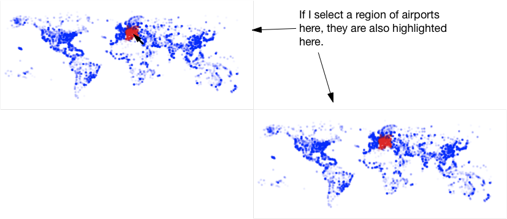

### Linking departure to arrival airports

This visualization is not really useful. But how about we draw the departure airport in the top-left, and the arrival airport in the bottom-right. Brushing a group of departure airports in the top-left would then highlight the arrival airports in the bottom-right.

*Script 17*
``` {.java .numberLines}
import java.util.*;

Table table;
ArrayList<Flight> flights = new ArrayList<Flight>();

class Flight {
  int distance;
  float from_long;
  float from_lat;
  float to_long;
  float to_lat;
  String from_country;
  String to_country;
  boolean domestic;
  float x1;
  float y1;
  float x2;
  float y2;
  
  Flight(int d,
         float f_long, float f_lat,
         float t_long, float t_lat,
         String f_country, String t_country) {
    distance = d;
    from_long = f_long;
    from_lat = f_lat;
    to_long = t_long;
    to_lat = t_lat;
    from_country = f_country;
    to_country = t_country;
    
    x1 = map(from_long,-180,180,10,(width/2)-10);
    y1 = map(from_lat,-180,180,(height/2)-10,10);
    x2 = map(to_long,-180,180,(width/2) + 10,width-10);
    y2 = map(to_lat,-180,180,height-10,(height/2)+10);
  }
  
  boolean visible() {
    if ( dist(mouseX, mouseY, x, y) < 10 ) {
      return true;
    } else {
      return false;
    }
  }

  void drawDepartureAirport() {
    if ( visible() ) {
      fill(255,0,0,25);
    } else {
      fill(0,0,255,10);
    }
    ellipse(x1,y1,3,3);
  }
  
  void drawArrivalAirport() {
    if ( visible() ) {
      fill(255,0,0,50);
    } else {
      fill(0,0,255,1);
    }
    ellipse(x2,y2,3,3);
  }
  
  void drawAirports() {
    drawDepartureAirport();
    drawArrivalAirport();    
  }
}

void setup() {
  size(800,800);
  fill(0,0,255,10);
  table = loadTable("flights.csv","header");
  noStroke();
  noLoop();
  for ( TableRow row : table.rows() ) {
    int distance = row.getInt("distance");
    float from_long = row.getFloat("from_long");
    float from_lat = row.getFloat("from_lat");
    float to_long = row.getFloat("to_long");
    float to_lat = row.getFloat("to_lat");
    String from_country = row.getString("from_country");
    String to_country = row.getString("to_country");
    Flight thisFlight = new Flight(distance,
                                   from_long, from_lat,
                                   to_long, to_lat,
                                   from_country, to_country);
    flights.add(thisFlight);
  }
}  

void draw() {
  background(255,255,255);
  for ( Flight my_flight : flights ) {
    my_flight.drawAirports();
  }
}

void mouseMoved() {
  redraw();
}
```

Let's see what changed compared to script 16:

* We changed the calculation of `x2` and `y2` to use `to_long` and `to_lat` instead of `from_long` and `from_lat` (lines 34 and 35).
* We removed the instruction to draw an ellipse at position `(x2,y2)` from the `drawDepartureAirport()` function (lines 46 to 53).
* We created a new function `drawArrivalAirport()` (lines 55 to 62). We also set the colour in this function to be very transparent (opacity set to `1` instead of `10`), so that it is more clear which of the airports is active.
* We created a new function `drawAirports()` (lines 64 to 67), which basically just calls the `drawDepartureAirport()` and `drawArrivalAirport()` functions.
* In the `draw()` function, we replace `my_flight.drawDepartureAirport()` with `my_flight.drawAirports()` so that both plots are made.

The resulting figure should look like this (without the annotated text):

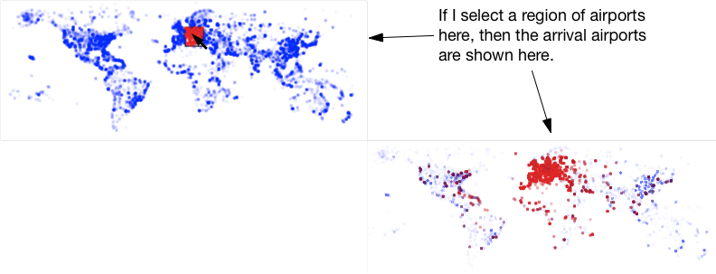

### Using a histogram as a filter

As a final version of a brushing-and-linking plot, we'll include a histogram in the picture. By hovering over the different bars in the histogram we can filter airports in the departure and arrival subplots. Let's first look at the code:

*Script 18*
``` {.java .numberLines}
import java.util.*;

Table table;
ArrayList<Flight> flights = new ArrayList<Flight>();
int activeHistBin;
Histogram hist;

class Flight {
  int distance;
  float from_long;
  float from_lat;
  float to_long;
  float to_lat;
  String from_country;
  String to_country;
  boolean domestic;
  float x1;
  float y1;
  float x2;
  float y2;
  
  Flight(int d,
         float f_long, float f_lat,
         float t_long, float t_lat,
         String f_country, String t_country) {
    distance = d;
    from_long = f_long;
    from_lat = f_lat;
    to_long = t_long;
    to_lat = t_lat;
    from_country = f_country;
    to_country = t_country;
    
    x1 = map(from_long,-180,180,10,(width/2)-10);
    y1 = map(from_lat,-180,180,(height/2)-10,10);
    x2 = map(to_long,-180,180,10,(width/2)-10);
    y2 = map(to_lat,-180,180,height-10,(height/2)+10);
  }
  
  boolean visible() {
    if ( distance/1000 == activeHistBin ) {
      return true;
    } else {
      return false;
    }
  }

  void drawDepartureAirport() {
    if ( visible() ) {
      fill(255,0,0,25);
    } else {
      fill(0,0,255,10);
    }
    ellipse(x1,y1,3,3);
  }
  
  void drawArrivalAirport() {
    if ( visible() ) {
      fill(255,0,0,50);
    } else {
      fill(0,0,255,1);
    }
    ellipse(x2,y2,3,3);
  }
  
  void drawAirports() {
    drawDepartureAirport();
    drawArrivalAirport();    
  }
}

class Histogram {
  // We'll draw the histogram starting at position 50, with
  // each of the bins being 5 pixels wide.
  // The histogram will have 16 bins.
  
  int[] data = new int[16];
  
  Histogram() {
    for ( TableRow row : table.rows() ) {
      int distance = row.getInt("distance");
      int bin = distance/1000;
      data[bin] += 1;
    }
  }
  
  int active() {
    if ( mouseY > 400 && mouseY < 700 && mouseX > (width/2) + 50 && mouseX < (width/2) + 130 ) {
      return (mouseX - width/2 - 50)/10;      
    } else {
      return 17;      
    }
  }
  
  void show() {
    float x;
    float binHeight;
    
    for ( int i = 0; i < data.length; i++ ) {
      if ( i == activeHistBin ) {
        fill(255,0,0,100);
      } else {
        fill(0,0,0,100);
      }
      x = width/2 + 50+i*10;
      binHeight = map(data[i], 0, 26154, 0, -300);
      rect(x,700,8,binHeight);
    }
  }
}

void setup() {
  size(800,800);
  fill(0,0,255,10);
  table = loadTable("flights.csv","header");
  noStroke();
  noLoop();
  hist = new Histogram();
  
  for ( TableRow row : table.rows() ) {
    int distance = row.getInt("distance");
    float from_long = row.getFloat("from_long");
    float from_lat = row.getFloat("from_lat");
    float to_long = row.getFloat("to_long");
    float to_lat = row.getFloat("to_lat");
    String from_country = row.getString("from_country");
    String to_country = row.getString("to_country");
    Flight thisFlight = new Flight(distance,
                                   from_long, from_lat,
                                   to_long, to_lat,
                                   from_country, to_country);
    flights.add(thisFlight);
  }
  
  activeHistBin = 0;
}  

void draw() {
  background(255,255,255);
  noStroke();
  activeHistBin = hist.active();
  hist.show();
  println(activeHistBin);
  for ( Flight my_flight : flights ) {
    my_flight.drawAirports();
  }
}

void mouseMoved() {
  redraw();
}
```

The approach we take in this plot is the following: if the user hovers over the histogram, the selected bar is saved in a variable called `activeHistBin`, which is then used in the `visible()` method of the flights. The resulting picture will look something like this:

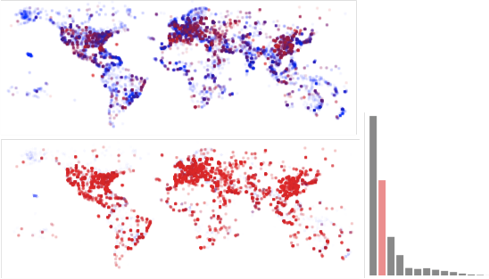

Let's see how that last script is different from script 17...

* We create a new class `Histogram` (lines 72 to 110)that holds an array consisting of 16 integers (line 77). The `int[] data = new int[16]` means: "Create a variable called 'data' that is an array of integers (`int[]` instead of just `int`), and assign it a new array of integers of length 16". For the `flights` variable, we needed to use an `ArrayList` because we didn't know the length of the array beforehand. This is different for the histogram. The distances in the dataset range from 0 to 15406 km. We'll simply take 16 bins, so we can easily assign a flight to a bin by dividing the distance by 1000 (line 82).
* The moment we create a new `Histogram` object (we'll create only one), 

# Whereto from here?

There are many different ways to show this information. This exact same dataset was visualized by Till Nagel during the visualization challenge in 2012 from visualising.org. Part of his entry is shown in Figure 13.

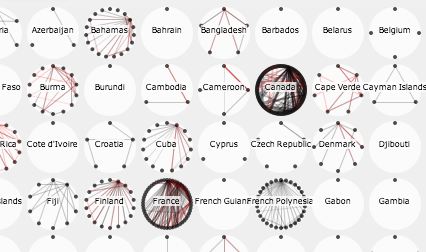

Till focused on domestic flights, and wanted to show how many of these are served by domestic airlines or by foreign airlines.

Also have a look at Aaron Koblin's visualization of flight patterns at http://www.aaronkoblin.com/work/flightpatterns/.

## Exercise

* Alter the script to map other data attributes to these visuals. Can you find new insights?
* What other ways of visualizing this data could you think of?